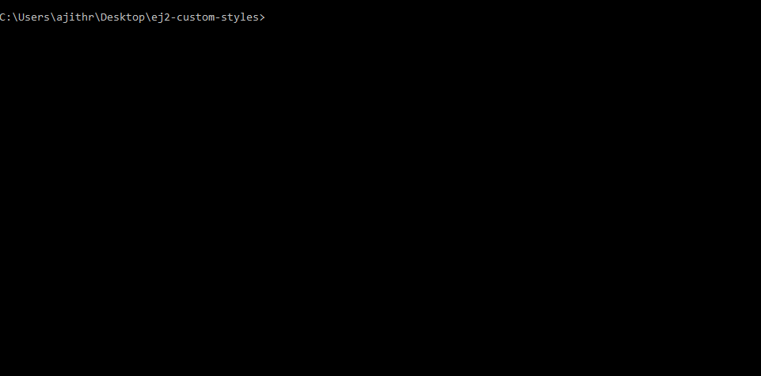

# Custom Style Generator for Essential JS 2 Components

## Installing

To install the dependent packages, use the below command.

> npm install

## Customizing Themes

- The Essential JS 2 components style variables are already declared in the [`styles/definition`](https://github.com/ajithr/ej2-custom-styles/tree/master/styles/definition) location, categorized by theme name.

- You can change the specific variable's color value to generate the customized theme.

For example, Changing `$accent` and `$primary` variable colors in material theme definition will generate a customized material theme with provided color changes.
```
$accent: #607D8B;
$primary: #B0BEC5;
```
- Now run the below command and choose the `Essential JS 2` packages for creating custom styles.

> npm run compile

- After executing the above command, the final output `{theme-name}.css` files will be created under [`styles`](https://github.com/ajithr/ej2-custom-styles/tree/master/styles) location.


