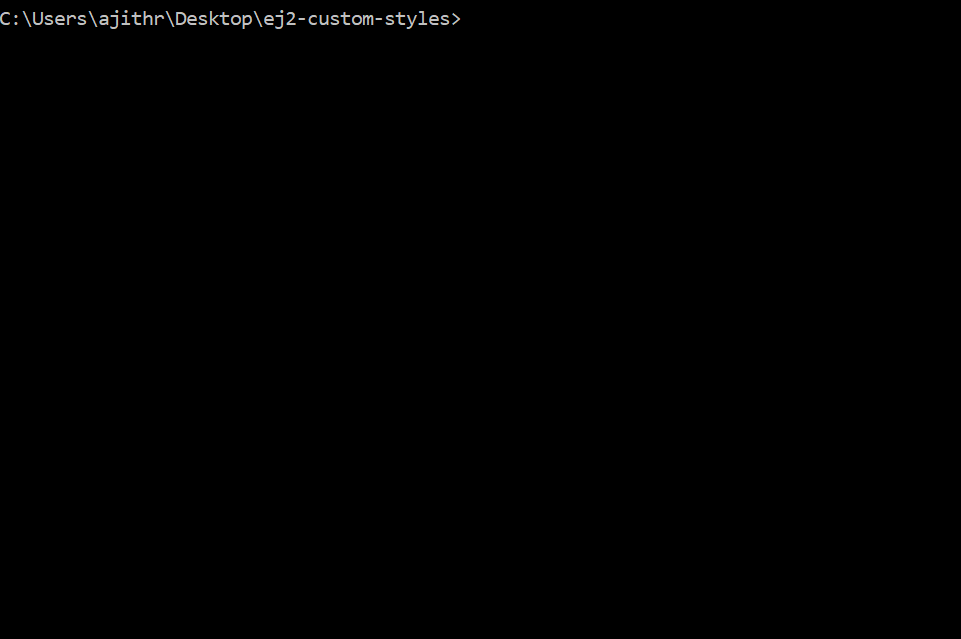

# Custom Style Generator for Essential JS 2 Components

## Installing

Use the below command to install the dependent packages.

`
npm install
`

## How to Customize Essential JS 2 Component Styles?

- The Essential JS 2 components style variables are already declared in the `styles/definition` location, categorized by theme.

- You can change the corresponding variable's color value for your customization.

- Now run the below command and choose the `Essential JS 2` packages for creating custom styles.

`
npm run compile
`

- The customized `{theme-name}.css` files will be generated under `styles` location.

